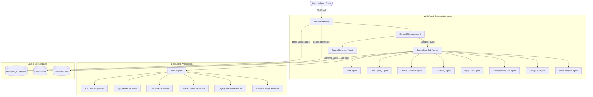

# NBA Agentic AI — Advanced Trade Simulator & Front Office Copilot

A production-grade, enterprise-scale Multi-Agent AI system designed to simulate the decision-making processes of an NBA Front Office. Instead of relying on a generic chatbot interface, this system uses an **orchestrated multi-agent architecture** powered by GPT models. The AI reasons, plans, retrieves real-time rules, calls specialized machine learning tools, caches simulations, logs trace telemetry, and synthesizes structured recommendations with trade grades and confidence scores.

---

## 🏗️ System Architecture

The project has been refactored into a decoupled, highly concurrent architecture featuring a React+Tailwind frontend, a FastAPI gateway, background workers, an async PostgreSQL DB, a Redis cache, and a ChromaDB vector database.



---

## 🤖 The 10 Specialized Agents

The system uses a strictly orchestrated **Router-Supervisor** pattern. The **General Manager Agent** acts as the router, while the **Report Generator** acts as the final synthesizer.

1. **General Manager Agent (`agents/general_manager.py`)**: Evaluates the user query, builds an execution plan, and routes sub-tasks to the correct agents.
2. **Trade Analysis Agent (`agents/trade_analysis.py`)**: Focuses on trading players, evaluating player ratings, and reviewing past matchups.
3. **Salary Cap Agent (`agents/salary_cap.py`)**: Ensures trade compliance against CBA regulations and calculates tax implications.
4. **Championship Simulation Agent (`agents/championship_sim.py`)**: Runs playoff models and championship probability forecasts.
5. **Injury Risk Agent (`agents/injury_risk.py`)**: Estimates injury history, back-to-back load, and games-missed predictions.
6. **Chemistry Agent (`agents/chemistry.py`)**: Analyzes locker room synergy, usage conflicts, and positional overlaps.
7. **Roster Optimizer Agent (`agents/roster_optimizer.py`)**: Builds optimal 5-man lineups and calculates minute rotations.
8. **Free Agency Agent (`agents/free_agency.py`)**: Discovers value signees, sleepers, and MLE-compatible targets.
9. **Draft Agent (`agents/draft.py`)**: Projects rookie talent fit based on drafting positions and team weaknesses.
10. **Report Generator Agent (`agents/report_generator.py`)**: Aggregates all sub-agent telemetry, computes a weighted Trade Grade (A+ to F), and writes the final summary.

---

## 🛠️ The Tool Layer & ML Models

Agents do not "think" up statistics or rules. They are forced to execute deterministic python tools registered via a custom decorator (`@tool`) in `tools/registry.py`.

*   **Player Predictor**: Runs an `XGBoost` model trained on historical player metrics to forecast future WARP, PER, and win-shares.
*   **Matchup Predictor**: Uses a `Logistic Regression` model to predict head-to-head match outcomes based on roster matchups.
*   **Championship Monte Carlo**: Simulates the remaining season and playoffs 1,000+ times to predict championship odds.
*   **CBA Salary Validator**: Programmatically parses the 2024 NBA Collective Bargaining Agreement (CBA) salary matching brackets (including the 125% over-the-cap matching rule).

---

## 💾 Caching & RAG (Retrieval-Augmented Generation)

*   **Redis Caching (`cache/redis_cache.py`)**: Caches heavy calculations (like the Monte Carlo simulation and player projections) with customized TTLs.
*   **ChromaDB Vector Store (`rag/vector_store.py`)**: Indexes detailed markdown files containing NBA CBA rules, trade exception criteria, and salary cap tiers. If an agent needs to know about first/second apron rules, it queries the local vector store instead of hallucinating.

---

## 📊 Observability & Telemetry

*   **Structured Logging (`observability/logging.py`)**: Emits JSON-formatted logs containing contextual metadata (e.g., current agent, tool being executed, execution times).
*   **Tracing Middleware (`observability/tracing.py`)**: Sets and propagates unique `X-Request-ID` headers to trace operations from the frontend request to the database.
*   **Prometheus Metrics (`observability/metrics.py`)**: Exposes request latencies, cache hit/miss rates, and agent runtimes via `/metrics`.

---

## 💻 Tech Stack & Setup

### Requirements
*   **Backend**: Python 3.12, FastAPI, SQLAlchemy, PostgreSQL, Redis, ChromaDB, Docker.
*   **Frontend**: React (Vite), Tailwind CSS, Lucide Icons, Recharts.

### Fast Execution (Docker Compose)
1. Clone this repository.
2. Setup environment variables:
   ```bash
   cp .env.example .env
   # Add your OPENAI_API_KEY
   ```
3. Run the services:
   ```bash
   docker-compose up --build
   ```
   *   **Frontend UI**: `http://localhost:5173`
   *   **FastAPI API**: `http://localhost:8000`
   *   **Swagger Docs**: `http://localhost:8000/docs`

### Manual Execution (Development)

**Backend:**
```bash
python -m venv venv
source venv/bin/activate
pip install -r requirements.txt
uvicorn api.main:app --reload
```

**Frontend:**
```bash
cd frontend
npm install
npm run dev
```

---

## 🧪 Testing

To run the unified test suite spanning unit testing of agents/tools, integration tests of database repositories, and API endpoint routing:
```bash
pytest tests/ -v
```
